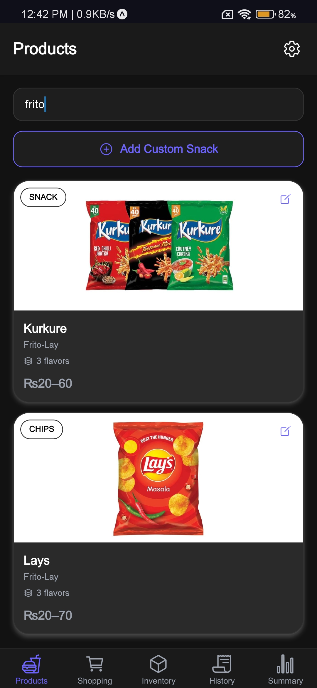
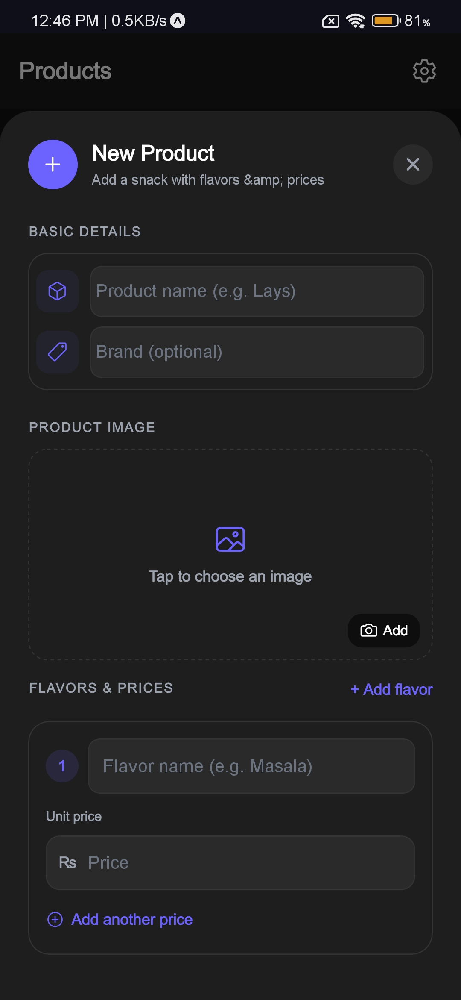
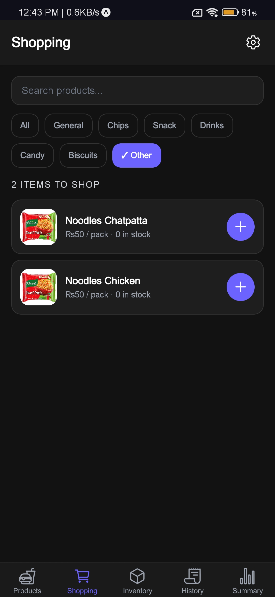
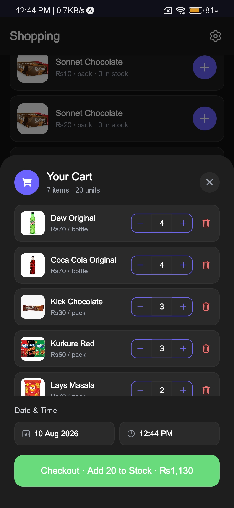
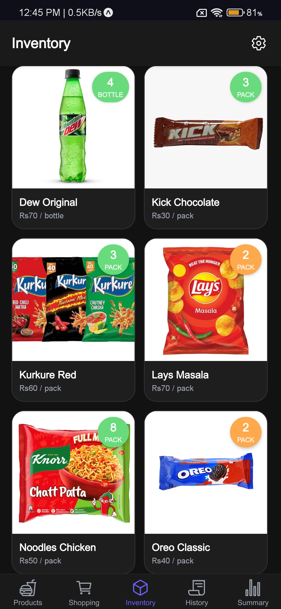
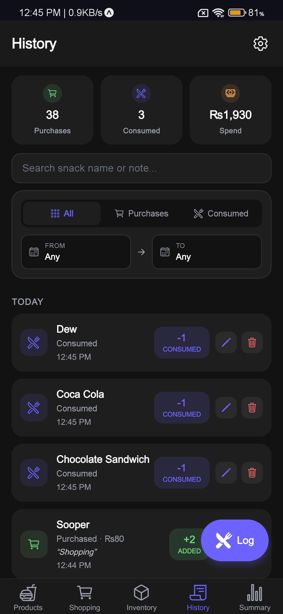
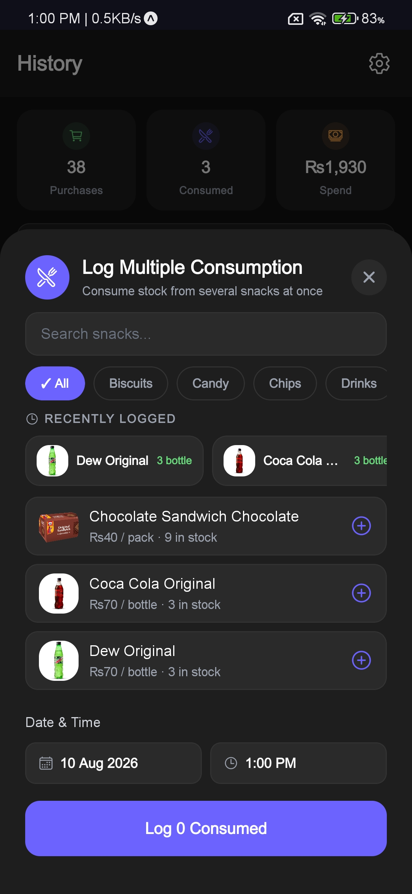
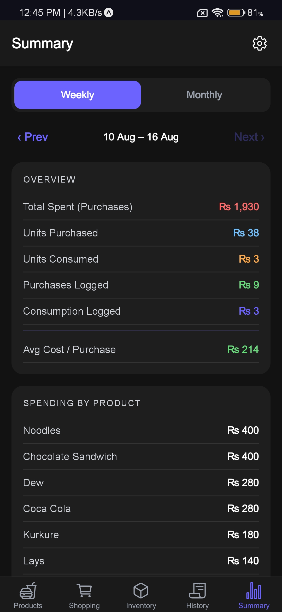
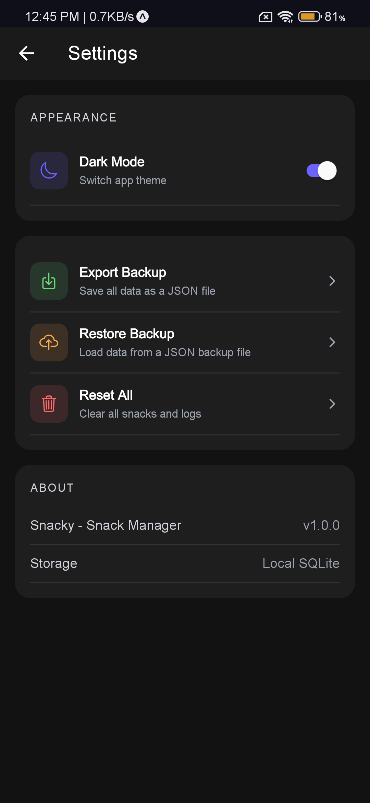

# Snacky — Snack Manager App (Expo + React Native)

Snacky is a simple snack management app built with **Expo (React Native)**. It allows you to manage snacks, stock multiple items, track consumption, view stocking and consumption history, and monitor weekly and monthly expenditure.

The app stores data locally using **SQLite** and supports custom snacks with images, brands, and multiple variants. It also includes a backup and restore system that preserves custom snack images.

## Screenshots

|                 Products                  |               Add Custom Product                |           Shopping Transactions           |
| :---------------------------------------: | :---------------------------------------------: | :---------------------------------------: |
|  |  |  |

|                 Cart                  |                 Inventory                  |                 History                  |
| :-----------------------------------: | :----------------------------------------: | :--------------------------------------: |
|  |  |  |

|                 Consumption                  |                 Summary                  |                  Setting                  |
| :------------------------------------------: | :--------------------------------------: | :---------------------------------------: |
|  |  |  |

## Features

### Products

- Browse and manage snacks
- Add custom snacks
- Add custom snack images
- Specify snack brands
- Create and manage multiple snack variants

### Shopping

- Add multiple snack items to a shopping list
- Select snack variants
- Specify quantities and prices
- Stock multiple items at once
- Automatically update inventory after stocking

### Inventory

- View all currently stocked snacks
- See available quantities
- Track snack variants
- Consume snacks directly from inventory

### History

- Log stocking activities
- Log snack consumption
- View stocking and consumption history
- Track quantities and expenditure

### Summary

- View weekly expenditure
- View monthly expenditure
- Monitor snack spending
- Track expenditure over time

### Settings

- Manage application settings
- Create data backups
- Restore previous backups
- Backup custom snack images

### Local-First Storage

- Data is stored locally using SQLite
- No backend server is required
- Normal app functionality works without an internet connection

## Tech Stack

- **Expo SDK ~57**
- **React 19**
- **React Native**
- **React Navigation**
- **expo-sqlite** — local persistent storage
- **expo-image-picker** — custom snack images
- **expo-file-system** — file and image handling
- **expo-sharing** — backup sharing
- **expo-document-picker** — backup restoration
- **@react-native-community/datetimepicker** — date selection
- **expo-updates** — OTA update support

## Project Structure

```text
.
├── App.js
├── src/
│   ├── context/
│   │   └── ThemeContext.js
│   │
│   ├── db/
│   │   └── database.js
│   │
│   ├── screens/
│   │   ├── Products/
│   │   ├── Shopping/
│   │   ├── Inventory/
│   │   ├── History/
│   │   ├── Summary/
│   │   └── Settings/
│   │
│   ├── hooks/
│   │   └── useOTAUpdate.js
│   │
│   └── components/
│
├── assets/
├── app.json
├── eas.json
└── package.json
```

> The exact project structure may vary depending on the current implementation.

## Data Model

Snacky uses **SQLite** for local persistent storage.

The database stores information related to snacks, variants, inventory, history, and settings.

### Snacks

Stores the main snack/product information.

- `id`
- `name`
- `brand`
- `image`
- Other snack metadata

### Variants

Stores different variants belonging to a snack.

- `id`
- `snack_id`
- `name`
- Variant-specific information

### Inventory

Stores currently stocked snack quantities.

- Snack
- Variant
- Quantity
- Stock information

### Stocking History

Records when snacks are added to inventory.

- Snack
- Variant
- Quantity
- Price/expenditure
- Date

### Consumption History

Records when snacks are consumed.

- Snack
- Variant
- Quantity
- Date

### Settings

Stores application-level settings and preferences.

The exact database schema may change as the application evolves.

## Shopping & Inventory Flow

Snacky separates **shopping/stocking** from **inventory management**.

```text
Products
   ↓
Select Snack / Variant
   ↓
Shopping
   ↓
Add Multiple Items
   ↓
Stock Items
   ↓
Inventory Updated
   ↓
Consumption
   ↓
History Updated
```

When items are stocked, the inventory quantity is increased and the stocking activity is recorded in history.

When a snack is consumed, the inventory quantity is decreased and a consumption record is created.

## Summary

The Summary screen provides an overview of snack expenditure.

### Weekly Summary

Displays expenditure for the current week to help track recent snack spending.

### Monthly Summary

Displays expenditure for the current month to provide a broader view of snack spending.

Summary data is calculated from stocking/purchase records stored locally in SQLite.

## Backup & Restore

Snacky supports backing up local application data from the **Settings** screen.

A backup can contain:

- Custom snacks
- Snack brands
- Snack variants
- Inventory
- Stocking history
- Consumption history
- Settings
- Custom snack images

### Custom Snack Images

Custom snack images are included in the backup instead of storing only their original device paths.

This allows custom snack images to be restored when a backup is imported onto another installation or device.

```text
Snacky Backup
│
├── Database Data
│   ├── Snacks
│   ├── Variants
│   ├── Inventory
│   ├── Stocking History
│   ├── Consumption History
│   └── Settings
│
└── Custom Snack Images
    └── Image Files
```

## Getting Started

### Prerequisites

- Node.js
- npm
- Expo CLI or `npx expo`
- Android Studio for local Android builds (optional)
- Xcode for local iOS builds (macOS only)

### Install

```bash
npm install
```

### Run

Start the Expo development server:

```bash
npx expo start
```

Then use:

- **Android** — press `a`
- **iOS** — press `i`
- **Web** — press `w`

You can also scan the QR code using **Expo Go** for supported development workflows.

## Build & Release

Snacky can be built using **EAS Build**.

### Android

```bash
eas build -p android
```

### iOS

```bash
eas build -p ios
```

Make sure your Expo and EAS configuration is correctly configured before creating production builds.

## OTA Updates

Snacky supports **Expo Updates** for over-the-air updates in production builds.

This allows supported JavaScript and asset updates to be delivered without requiring users to manually reinstall the application.

## Local Storage

Snacky is designed as a **local-first application**.

Normal functionality does not require a backend server or remote database.

```text
React Native / Expo
        │
        ▼
   Application UI
        │
        ▼
    SQLite Database
        │
        ├── Snacks
        ├── Variants
        ├── Inventory
        ├── History
        └── Settings
```

This makes Snacky suitable for managing personal snack inventory even when there is no internet connection.

## Scripts

| Command                | Description                       |
| ---------------------- | --------------------------------- |
| `npx expo start`       | Start the Expo development server |
| `npx expo run android` | Run the app on Android            |
| `npx expo run ios`     | Run the app on iOS                |
| `npx expo run web`     | Run the app on Web                |
| `eas build -p android` | Create an Android EAS build       |
| `eas build -p ios`     | Create an iOS EAS build           |

## License

This project is for personal use and development.
